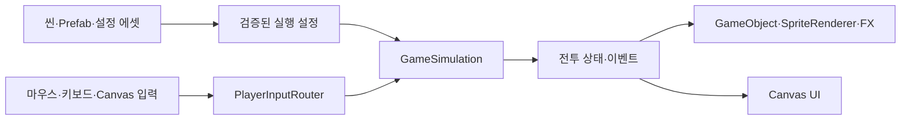

# GameObject·Prefab 구조 개편 계획

작성일: 2026-09-21. 상태: 사용자 승인 후 구현 진행.

최종 승인 범위: 아래 초기 계획보다 우선하여 캐릭터·몬스터·스킬·특수능력·증강·스폰·밸런스를 ScriptableObject 데이터로 전환한다. 개별 정의 에셋을 GameDatabase에서 등록·삭제하며 Inspector와 전용 관리 창에서 수정한다. 실행 시 검증된 스냅샷을 주입하고, 원본 에셋을 전투 중 변경하지 않는다. UI까지 단계별 구현을 계속 진행하며 중간 추가 승인 없이 에디터 검증까지 완료한다. 별도 플랫폼 빌드는 생성하지 않는다.

사용자 범위: 캐릭터·몬스터·FX·맵을 GameObject 기반으로 전환한다. UI도 포함하되 월드 전환 뒤에 Canvas로 옮긴다. 원본 그래픽 방향과 전투 느낌을 유지하며 별도 플랫폼 빌드는 생성하지 않는다.

## 1. 권장 구조

전투 상태와 판정은 기존 `GameSimulation`이 관리하고, 실제 장면 표현과 제작은 저장된 씬·GameObject·Prefab·설정 에셋을 사용한다. 이 구조는 기존 전투를 유지하면서 Unity 에디터에서 리소스 교체, 크기·위치·레이어 조절, 맵 배치, FX와 UI 제작을 가능하게 한다.

캐릭터마다 실제 GameObject와 컴포넌트가 생긴다. 이동·공격·피해·스폰·쿨타임을 동시에 여러 컴포넌트에서 계산하지는 않는다. 게임 판정을 Rigidbody/Collider/Animator 이벤트로 다시 구현하는 작업은 이번 전환 범위에 포함하지 않는다.



## 2. 현재 구조에서 유지하거나 바꿀 부분

| 현재 | 개편 후 |
| --- | --- |
| `SurvivorGame`에 입력·실행 관리 집중 | `GameSession` 실행 관리와 `PlayerInputRouter` 입력 책임 분리 |
| `GameSimulation`, `RunState`의 전투 판정 | 유지. 설정 주입과 표현용 식별자/이벤트 연결만 필요한 범위에서 추가 |
| `SurvivorPresentation.OnGUI()` 월드 표현 | `WorldViewRegistry`와 개체별 View 컴포넌트 |
| 캐릭터 텍스처의 UV 직접 선택 | 에디터에서 분할한 Sprite와 `DirectionalSpriteSet` 설정 |
| 코드로 생성하는 몬스터·맵 이미지 | 저장된 Sprite, Prefab, 맵 레이어로 전환 |
| IMGUI 타이틀·HUD·증강·결과 | 뒤 단계에서 저장된 Canvas와 UI Prefab으로 전환 |
| 정적 C# 전투 카탈로그, 코드에 고정된 외형·맵 설정 | 전투 카탈로그 유지. 외형·Prefab·맵 설정은 편집용 에셋으로 분리 |

기존 프로젝트에는 게임용 Prefab이 없고 실제 게임 씬의 루트는 카메라와 실행 호스트 두 개다. 플레이어 아틀라스는 이미 세 직업 모두 존재한다. 기존 46개 자동 테스트는 개편의 기준으로 사용하되 구현 시작 시 현재 버전에서 다시 확인한다.

## 3. 목표 씬

초기에는 한 게임 씬을 유지한다. 씬 분할까지 동시에 진행하지 않는다. 이행용 씬에서 기존 씬과 비교하고, 동등성 확인 후 새 구성을 기본 씬으로 삼는다.

```text
SurvivalLegend
├─ Systems
│  ├─ GameSession
│  ├─ PlayerInputRouter
│  ├─ WorldProjection
│  ├─ WorldViewRegistry
│  └─ CombatFxPresenter
├─ Main Camera
├─ World
│  ├─ Arena
│  │  ├─ Ground
│  │  ├─ FloorTiles
│  │  ├─ Decorations
│  │  ├─ Bounds
│  │  └─ SpawnMarkers
│  ├─ Characters
│  ├─ Enemies
│  ├─ Projectiles
│  ├─ Zones
│  └─ Effects
├─ Pools
└─ UI
   ├─ EventSystem
   └─ Canvas
      ├─ Title
      ├─ CharacterSelect
      ├─ CombatHUD
      ├─ AugmentSelection
      ├─ Pause
      └─ Results
```

맵, 시스템, Canvas와 고정 UI는 편집 모드에 저장한다. 플레이어·적·투사체는 실제 Prefab 에셋을 참조해 런타임에 인스턴스화한다. 결과 기록처럼 개수가 달라지는 UI는 저장된 행 Prefab을 재사용한다.

## 4. 캐릭터·몬스터·애니메이션

- 공통 Actor 기반으로 검사·궁수·마법사 Prefab Variant 3개와 추격자·사수·주술사·엘리트 Variant 4개를 구성한다.
- 루트는 발밑 위치와 개체 연결을 담당한다. 자식으로 Shadow, Visual/Body, Shield, StatusEffects, SelectionMarker, HealthBar를 구분한다.
- 루트 `SortingGroup`과 발밑 깊이로 개체 간 앞뒤 순서를 정한다. 발사체 높이, 몸의 상하 움직임, 공격 애니메이션이 정렬 기준을 바꾸지 않게 한다.
- 플레이어 아틀라스는 768×1024, 셀 128×128, 8방향×6프레임을 유지한다. Sprite Pivot은 기존 발밑 `(64,112)`를 Unity 기준 `(0.5,0.125)`로 변환한다.
- `DirectionalSpriteSet`에서 직업별 Sprite, 대기·이동·공격 프레임, 표시 배율을 편집한다. 몬스터의 현재 절차적 이미지는 유한한 방향·자세별 Sprite 에셋으로 내보낸다.
- 프레임 선택은 시뮬레이션의 방향·이동·공격 진행률에 연결한다. 공격 판정 시점을 Animator나 Animation Event로 옮기지 않는다. 독립적인 장식 애니메이션에는 Animator를 사용할 수 있다.
- Inspector에는 연결된 개체 ID, 논리 좌표, HP, 현재 행동을 읽기 전용으로 표시한다. 실행 중 수동 이동이 필요하면 Transform 덮어쓰기 대신 명시적인 디버그 이동 명령을 제공한다.

## 5. 좌표·맵 편집

기존 1440×1440 논리 좌표와 쿼터뷰 투영을 유지하고 Unity XY 평면에 표시한다. `WorldProjection` 하나에서 좌표 변환, 역변환, 정렬 기준을 관리한다.

기준안은 100 PPU, 1280×720 표시 영역, 직교 카메라 크기 3.6이다. 기존 `WorldToView` 결과를 `((viewX-640)/100, (360-viewY)/100)`으로 변환한다. 화면 크기가 바뀌면 원본과 같은 비율·여백을 유지하고 마우스 입력에도 같은 뷰포트 역변환을 적용한다.

맵은 우선 현재 배경을 저장된 Sprite로 옮겨 외형을 맞춘다. 바닥 타일, 단차 가장자리, 문양, 코너 장식, 추가 소품을 별도 레이어와 Prefab으로 분리한다. 바닥은 원본의 18×18 타일과 투영 비율에 맞는 Tilemap 또는 편집용 배치 도구를 사용한다. 같은 바닥 무늬를 배경과 Tilemap에서 중복으로 그리지 않는다.

`ArenaAuthoring`의 경계와 스폰 마커는 Gizmo/Handle로 편집한다. 이 값은 시작 시 실행 설정으로 변환되어 실제 스폰과 이동 제한에 반영되어야 한다. 장식 배치와 전투 경계를 구분한다. 현재 게임에 없는 장애물 회피·길찾기를 단순 Collider 배치만으로 추가하지 않는다.

## 6. 투사체·장판·FX와 생명주기

Prefab 종류는 화살, 화염구, 번개, 근접 타격, 장판 경고, 낙하 공격, 회전 공격, 보호막, 피해 숫자, 이동 마커 등으로 구성한다. SpriteRenderer, LineRenderer 또는 단순 메쉬를 효과에 맞게 사용하고 픽셀 스타일을 유지한다. ParticleSystem은 추가 장식이 필요한 효과에 한해 사용한다.

- 지속 개체: `(실행 세대, 개체 종류, ID)`로 상태와 View를 연결한다. 상태가 생기면 생성/대여하고 제거되면 회수한다.
- 순간 효과: 틱 번호와 별도 이벤트 ID를 가진 이벤트를 매 시뮬레이션 틱에서 수집해 한 번씩 소비한다. 기존 전투용 ID와 난수 소비 순서를 바꾸지 않는다.
- 효과의 위치·높이·반경·잔여 시간은 시뮬레이션에 맞춘다. 레벨업, 증강, 일시정지, 사망에서 각 효과가 멈추거나 정리되는 시점도 정의한다.
- 풀 반환 시 색상·크기·정렬·Trail·Particle·텍스트·타깃 참조·예약 동작을 초기화한다.
- 재시작·타이틀 복귀 시 이전 실행의 연결과 미소비 이벤트를 모두 비운다. 같은 ID가 새 실행에서 재사용돼도 이전 효과가 붙지 않아야 한다.
- GameObject를 숨기거나 비활성화하는 것은 표현 상태 변경이며 적 사망 판정이 아니다.

## 7. 데이터 편집

이번 개편에서는 `WorldVisualDatabase`, `DirectionalSpriteSet`으로 외형을 관리하고, `GameDatabase`와 개별 정의 ScriptableObject로 캐릭터·몬스터·스킬·특수능력·증강·스폰·밸런스를 관리한다. 최초 데이터만 기존 카탈로그에서 이관하고 실제 플레이는 데이터베이스 에셋의 검증된 스냅샷을 사용한다.

맵·스폰 편집 값은 시작 시 검증하고 복사한 실행 설정으로 전달한다. 기본 경계와 스폰 순서는 기존 값과 동일하게 한다. 외형 에셋에는 전투 수치를 복제하지 않는다.

능력치는 Inspector에서 편집하며 전용 Database Manager에서 등록·생성·복제·제거·검증한다. 직렬화 가능한 편집용 데이터 → 독립된 실행 설정으로 변환하므로 플레이 중 증강이 원본 에셋을 수정하지 않는다. 기존 JSON과 정적 카탈로그는 최초 이관·회귀 테스트의 기준으로 보존한다.

## 8. Canvas UI

월드 전환이 끝난 뒤 타이틀, 직업 선택, 전투 HUD, 증강 카드, 일시정지, 결과를 Canvas와 UI Prefab으로 옮긴다. 버튼, 패널, 슬롯과 텍스트를 에디터에 저장하고 컨트롤러는 참조를 통해 내용과 활성 상태를 갱신한다.

- 기존 1280×720 기준과 화면 여백을 유지한다.
- 포함된 Noto Sans KR 폰트와 픽셀 아이콘을 재사용한다.
- InputSystem용 EventSystem을 사용한다. 화면 Y좌표만으로 UI를 판별하는 현재 방식을 실제 UI Raycast와 모달 상태 판정으로 교체한다.
- 카드 선택/리롤, 슬롯별 즉시 시전, D/F 선택, 궁극기 클릭, 결과 기록 스크롤과 직업 유지 재도전을 모두 옮긴다.
- UI 전환 애니메이션은 전투 시간과 별도로 운용할 수 있지만, 일시정지 중 전투 쿨타임이나 FX가 진행되지 않게 한다.

## 9. 진행 순서와 완료 기준

| 단계 | 작업 | 확인할 결과 |
| --- | --- | --- |
| 1. 전환 기반 | 기존 월드/HUD 그리기 분리, 새 씬, 투영·입력·뷰 연결 경계 | 기존 테스트 재확인, 카메라 월드가 IMGUI 배경에 가려지지 않음 |
| 2. 맵과 Actor | 맵 레이어, 플레이어 3종·적 4종 Prefab, 8방향 Sprite | Hierarchy에서 개체 선택, 프리팹 교체, 발밑·정렬·조준 일치 |
| 3. 전투 표현 | 투사체·장판·FX Prefab, 풀과 이벤트 처리 | 세 직업 전투와 엘리트 진행, 효과 누락·중복·잔상 없음 |
| 4. 편집용 설정 | 맵 경계/스폰·Prefab 연결·외형 에셋과 Inspector 정리 | 편집 값이 실행에 반영, 전투 수치는 기존 카탈로그 유지 |
| 5. Canvas | 저장된 UI 계층과 입력 연결 | 기존 화면/버튼 기능 동등, UI 클릭이 전투 명령으로 새지 않음 |
| 6. 정리·검증 | 기존 IMGUI 경로 제거, 참조·풀·회귀 검증, 문서 갱신 | 저장된 씬/Prefab으로 전체 런 가능, 반복 실행 시 객체 누적 없음 |

첫 사용자 확인 지점은 2단계 완료 후로 권장한다. Scene View에서 맵과 캐릭터를 선택하고 Prefab을 수정하는 작업 흐름, 게임 화면의 8방향·크기·조준을 확인한다. 3단계 완료 후에는 전투 한 판의 느낌을, 5단계 완료 후에는 UI 편집 및 조작을 확인한다.

## 10. 최종 검증과 팀 분담

- 기존 46개 테스트와 새 설정 변환/뷰 생명주기 테스트를 통과한다.
- 같은 시드·명령으로 전환 전후 이동·피해·쿨타임·성장·보상 순서를 비교한다.
- 8방향, 앞뒤 겹침, 활/지팡이 발사 위치, 장판 범위, 큰 적의 정렬을 확인한다.
- 16:9 및 다른 화면 비율에서 마우스 조준과 UI를 확인한다.
- 재시작·타이틀 복귀를 반복하고 최대 적 수 구간에서 개체 수, 풀 회수, 프레임 시간과 할당을 확인한다. 성능은 실제 측정으로 판단한다.
- 별도 Windows/WebGL 빌드를 생성하지 않고 Unity 에디터 검증을 수행한다. 최신 브라우저 플레이 검증은 이번 결과에 포함하지 않는다.

엔지니어(Astra High): 구조·입력·좌표·뷰 연결·풀·맵 설정 주입. AD(Sol High): Sprite 분할, 캐릭터/적/맵/FX Prefab과 Canvas 제작. 기획자(Terra High): 맵/스폰 설정 초기값, 밸런스·스킬·증강 검증. 총괄: 작업 경계·통합·회귀 및 사용자 확인 지점 관리.

이번 작업에서는 이 계획 문서만 작성한다. 실제 구조 변경, 씬/Prefab 생성, 테스트 실행, 빌드와 Git 업로드는 수행하지 않는다.
